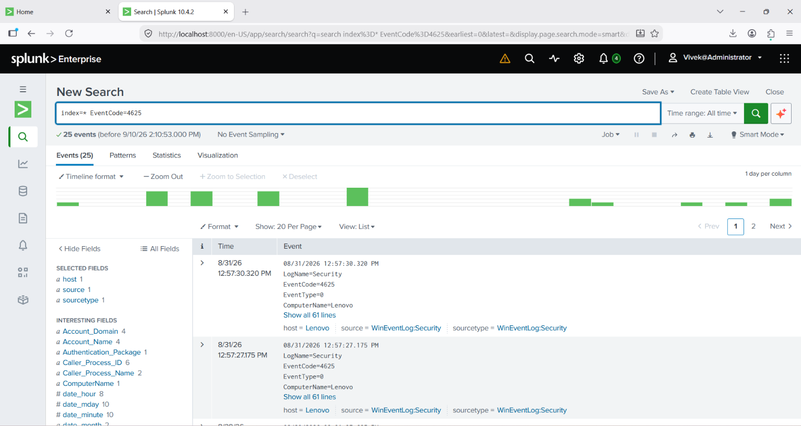
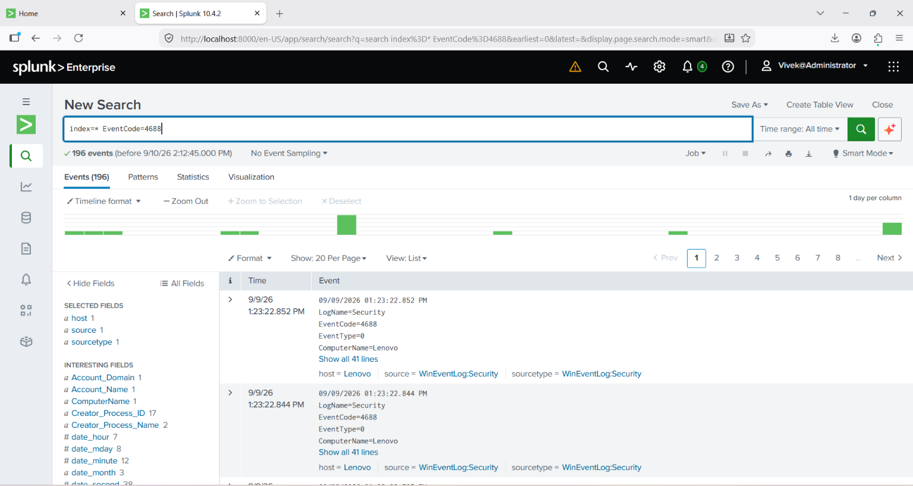

# Splunk Home Lab — Windows Event Log Monitoring

`#SOC` `#Splunk` `#SIEM` `#CyberSecurity` `#BlueTeam`

Built a home SOC lab using Splunk to ingest and analyze Windows Security Event
Logs, and wrote SPL queries to detect common security-relevant activity such
as failed logons, process creation, and account changes.

## Why This Matters

In a real SOC, Tier 1 analysts spend a large part of their day searching
through log data in a SIEM to spot suspicious activity — failed login
attempts that could indicate brute-force attacks, unexpected process
execution that could indicate malware, and account changes that could
indicate privilege escalation. This project simulates that workflow end to
end: log ingestion → query design → analysis.

## Setup

1. Installed Splunk Enterprise (free trial) on a local Windows machine.
2. Enabled **Local Event Log Collection** (Settings → Data Inputs) for:
   - Security
   - System
   - Application
3. Verified log ingestion via the Search & Reporting app.

## Search Queries & Findings

### 1. Failed Logon Attempts
```spl
index=* EventCode=4625
```
Detects failed login attempts — the earliest indicator of a brute-force or
credential-guessing attack. ✅ Results found.



### 2. New Process Creation
```spl
index=* EventCode=4688
```
Flags every new process launched on the system — useful for spotting
unexpected or malicious executables. ✅ Results found.



### 3. Successful Logons
```spl
index=* EventCode=4624
```
Provides a baseline of normal login activity to compare against failed or
unusual logons. ✅ Results found.


### 4. Failed Logons by Source IP
```spl
index=* EventCode=4625 | stats count by src_ip
```
Aggregates failed logon attempts by source IP — in a real environment, this
would immediately surface which host(s) are being targeted by a
brute-force attempt. ✅ Results found.


### 5. RDP Logons (Logon Type 10)
```spl
index=* EventCode=4624 Logon_Type=10
```
Flags remote desktop logons, which are a common lateral movement technique.
⚠️ No results in this lab session, since no RDP sessions occurred — but this
query would be essential in an environment with remote access enabled.

### 6. Account Lockouts
```spl
index=* EventCode=4740
```
Detects when an account is locked out after repeated failed attempts —
a strong brute-force indicator. ⚠️ No results, as no lockout occurred in
this lab session.

### 7. New User Account Created
```spl
index=* EventCode=4720
```
Flags new account creation, which can indicate privilege escalation or
persistence by an attacker. ⚠️ No results, as no new account was created
during this lab session.

## What I'd Add in a Production Environment

- Scheduled alerts on the failed-logon and account-lockout queries
- Correlation rules tying failed logons + new process creation on the same
  host within a short time window
- A dashboard consolidating all queries into a single view

## What I Learned

- How to ingest and search Windows Security Event Logs in Splunk
- Core SPL syntax, including filtering and the `stats` command for
  aggregation
- Which Windows Event IDs matter most for SOC L1 monitoring, and why
- That a "no results" query is still a meaningful finding when the
  reasoning behind it is documented
